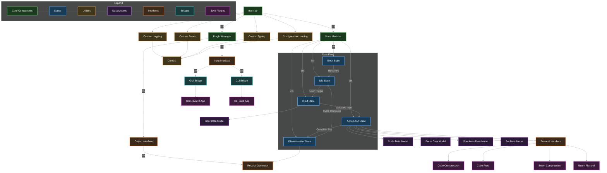
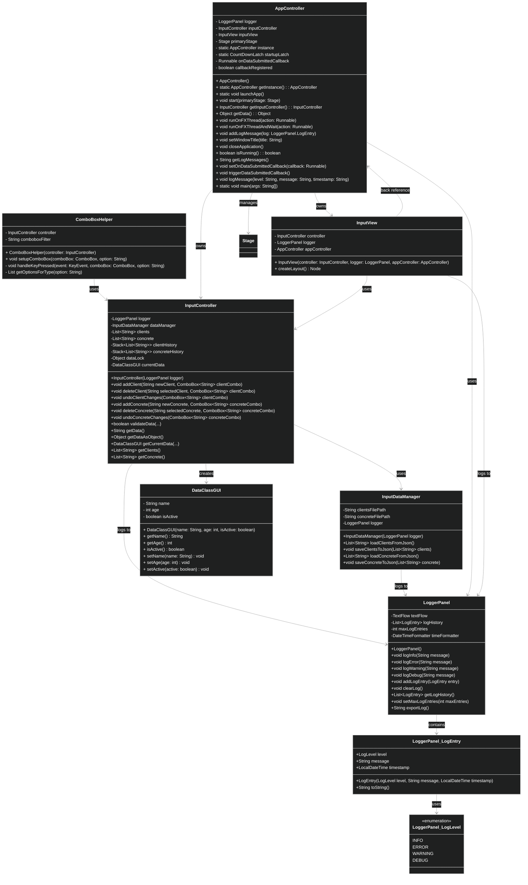

# Malg-ACTA (Automated Construction Testing and Analysis)

---

## Overview

This application is a GUI-based data acquisition and reporting tool for concrete sample testing. Its purpose is to streamline the process of Entering project/test metadata via GUI, Collecting data from compression and scale devices and automatically generating formal test reports in PDF or Excel format.

---


## How to Use

1. Start the app and load existing clients and concrete classes.
2. Enter or select input data.
3. Press 'Incepe testarea' button to submit your selected data.
4. The validation of your data started - check the log panel for info and error messages.
5. When the INFO message '' appears, check the `data/receipts/excel(pdf)_reciepts` for the created reports
---

## Workflow

1. User input via Graphical User Interface or Command Line Interface
  - The user enters:
    - Testing protocol 
    - Client name 
    - Concrete class
    - Sampling date
    - Tested set ID
    - Number of tests to be performed
    - Preferred output format (PDF or Excel)
    - Other details 
  - The input data is wrapped in `InputData` object
2. Measurement devices (scale and press) perform the measurements
3. Input data and test measurement data is wrapped in a SetData object
4. From SetData, the selected `output_format` determines which report type to generate:
    - "PDF"
    - "Excel"
and the selected `protocol` determines which protocol should be applied 
  - `cube_compression_testing` - *Rezistență la Compresiune Cuburi*:
  - `cube_frost_testing` - *Gelivitate Cuburi*:
  - `beam_compression_testing` - *Rezistență la Compresiune Prisme*:
  - `beam_flexural_testing` - *Rezistență la Încovoiere Prisme*:

5. Report Flow
   - Raw test data is processed into: 
     - Weights (kg)
     - Forces (N)
     - Pressures (MPa)
     - Densities (kg/m³)
   - A .pdf or .xlsx file is generated with:
     - Client and test metadata 
     - Table of test measurements 
     - Computed averages

---
## Control Flow Diagram

Decision tree available both [here](https://mermaid.live/view#pako:eNqdWg9T27gS_yqa3PB4NyN6xCEpZOau00LTx0x7MIW2855hOsJREg-OnbOdFi7w3d9qV7Il2Q5wMJNYq9_uSvtPspRNL8qmsjfu7exs4jQux2yzWy7kUu6O2e5U5Le7nBHhq8hjcZPIAno2bHeVx0uR3x9nSZYr7C9DMYzkSMF116W8K-vu2Wxm9b3L8qnM25iTOJU1Xeyrf0UvZJSlU0fjKBCHUuAAZV7GTt_gSP3vPj4-7uxcpbMk-xktRF6yy5OrlMHfzg77JOKUidUqiSNRxlnKFIr9jMsFy-V0Hckp-6HkRiJhxUpEcTon3osSJIX4CUKS-d7b48u31-z33_9gHzMxPZd5ERelTMsTUYpQkVhNYx_hu7gmSU04SjmJi1Ui7j98OQ31I4NnzVN3sr29P9iXQuanKRhARGoSoWozi6C5qlkr9TDqVMzBp2lJdE8ICiYMjnZDzzT0N4_EY_Ur_MN_ZfGAiAuZSBSzQV1VU_M5EOQ8TmIYCXB_WU1FKXVT4UKiME1C3utOMVka5RLRoihkLU_TNdmR67HYChqDaTO3A23q6Wap_HEpixIii33L8lsVgO3G_TN7MEgD3FAAaqrxigeqmFsH0QZGN56mq3V5LnKxhPnkRYjtaqh1hzaVB8dZfxVJrKyCfRvTIqgeqwNB5afpD0V7YBeL7CeS3-d5loeqSawMCVqvi0K13lC6FH0lNR-z6BatMhORDFWLQVpNYplM6xS1IKjiPM_KLMoSir6NaTYCvXLxifwRA-_xQoL8G1FAYYGQNXwEc4WiHmJDrg3xfpZ_rWOoTbqr0IosIE5O97I_sxJYxPT-QUO-iTwFB5I59ag07doWpWnd0dulUWszk3mXizRa1Ba6vF9J3zjH6xtZRda_j7PlKpdFAZp-m-RZUf7KXPuQSMp3xdlgeECJWuCkSij6LNY381ysFj4mbJdlxqWNo_4U8BTWyVB9xBBFf1ejv9YBaOhnaom7BLvdKptbeOxgpscS3sFLfsAaA2aYqyGaAvYvsxywC1imVPtcdTODs4S7AqjES1Gsc1wHjhcZeHCDqwfFYGF3P9Zy6ifwHmm1gFAcykUNaWhAzxEXqZEq21UbymeK7Q11V-03lnIXWVU3JDvRTTLc4K4EOPHtmGWrJiyN5wnUgbMUu0NgW65gz4REdrGSUQxTVdmN_ZZemw31fpPxfFFCDYct1Ya-MH2sWq7-bJg7XUWLk7i8d-ZNeFZ1dpnA56bKZg1yyxDQDp9hP5ZPqS-khlGOW6jOILcZUSuWEZ1DKgUTqNwd4UbB_dJwI6463LBdhxt1t4abi6zsj2TH7CSjaWsbuTXcWjTV4XaaYndXuMUpsfvhptlQr7KvDjb1yIyh7dnWGHem7ZGGYjpm3B1dekydSq3YQuBnWayTKsBoPkR7VphZMl4aa7S6xTMmkoSVeoGKCxY12NqEbt4Cl1nW2ozdxlTv1jqipJMJzWYoChBW3e4aJtOptwC_k2LZugD_2rnyIouFfEAhFqFz3W3Bhb60llX33fF3eunqWnUB8DHLVqH6YDPYC0oBYy2sDClk6QpEqObFMOlvqwQVqPKRoegQ728vBD7a1dylB91qSJT9fa8KVHNUs57FOSTlsq6CLSPQYpwBYFz1qTL0W8PVRdpGUEyuDToqg4d1BqAHtVWfMcZFmeWScrpvCsMEJ05EP25qtKMyeI67gy53By9yd-Bq7tLT4u5gm7vpTORZ_g6a_g7I38HT_g46_B28wN9Bi7-Drfpa_B0Yf1_QzJ9weKUTpX4C-kZ9VEYsvBlXMEe_KhRbYNosxoj_tPBOEnm3zkXyRNU1MCq5prW13tqg0BHSVmknT1XayQsr7cSqtBNy8tbM05jatpPvz99veWBHa4cOcvPEjsuunIPJrbyNlsvo6KM3987dlgOzZ2slzfb8cqCOahrNNl1m1la2mNxqJpUDM4qelVOT1pya-Dk1acupyT_IqU_ZD8k-yFTm6u34bF2u1vAiGyWZeq8tM5aVC3i4SbLoVseDdxKAszMCND8BW7Yu28F23nUjvYT1MKE_F8stH850qoK3IxXNGCfkpIKSFSC0lfws53FR5vfm3MC0XXEu1kiYZPlS6LNWfRBl3qUY9RWPjhibgV7ATibW6xcggFDPDBrX2_nf30UycSUgqZaBzSekfKOFwxKiKLUM1XJFqHFrI5zncVpuIB3XiXoNgcYbd9I0RhvtdKPyzl6k1AmiPAuxjdRQPanQxZbMrzsYVcoAoZkyFDgmsOobARNCRpEZnfta5KWYF570SpsmzjEqtRsHqR7sGUfjb627mfd38Za7CtUL6I36VmzGN5peW1YRQkTVFzdNaOeBeTW0i_IeXlincqbuzKBbJ3Okjv5P5Ez1CFUrZ3GSjH8JpuqfQ1Jlt3KsL7V0c-9nPC0X42B1xyN1ezVWN2UNaVGMb0Ykrn80iIajStzBVIxmsxeIW-l6oaWJwU2_HtxQ3NyMBi-QJvHsnWSBJNEXlazZbBgNoxfIijNjMRAzOKwE3QxGo-nRCwQVsF6pGyuSdrA_GPWPKmlyXxwMD5-W5gTiPcgEn9uOtm9puHeXwp37Ke7cQHDr-Jy7B__c3ffxxoEWd88luX04x91DJF4frfC2gwNevWty922ragZuBzarhZqbTQV3dhfcXsy5V4e5KVncpJsJbdusXupx706HO1cy3JzI847Tc24fi3BzksD1xp57r4hem6ZcGWximCea2dkZcWvLws3qrB6ORRK9nSMNlhRuVguu1wVul2FulWDu1Uy0mklf22LOtQ13r8W4feTNWw9_ub1n5q0neNw_wODe67wPCDxAwL29Off2r1hH7EmR-errbm4fT3P7NJG752XcO1Xw2vVI9KY9zmy1zTt53rgK5p03vtw-3uaNQ0je3GXpUuVf08t5tfRWm0ObiHeT3090-oTm4Xo8Hrs5RUC9RzR7RQVz4ohQdNuqPfIbXbUC0nIN4U7PrN8Z4Gr-PqHzB0AbcxL0gqYXWr-AELChcc9tmTKz4nWM0TiShVICqqA6rpcpg6DI1mWbMWAN36un3GIFDXjvT8tcI-_hFN0Ja_LF1gH-J56q8WEBBknqtyyWfmje0sbhcMT0YpRmqWxFvH4Scfgk4qiJgPjp8d48j6e9cZmvJe8tJdRn1extFOSqh7_2ueqN4VH9AOiqd5U-As9KpP_LsqVhy7P1fNEbz0RSQGuNMX0SCwjUGgLK1I981mnZGw9RQm-86d31xnv94f6rwcGwfxgMXweDYLR_yHv3QA8ORq9G_deDwbA_PNg_PDp6_ch7f6Pawav-6OCwDz2Hw-Cg_5r35DQGK3-i3y_hz5ge_w-WCGAo) and below:

```mermaid
%%{init: {'theme': 'dark', 'themeVariables': { 'primaryColor': '#5a5ce6', 'primaryTextColor': '#fff', 'primaryBorderColor': '#5a5ce6', 'lineColor': '#a0a0a0', 'secondaryColor': '#62a8ea', 'tertiaryColor': '#393939'}}}%%
flowchart TD
    %% Main application flow with reduced vertical spacing
    Start[Start Malg-ACTA] ==> LoadPersistentData[Load Persistent Lists]
    LoadPersistentData ==> DisplayGUI[Display GUI]
    DisplayGUI --> UserInteraction[User Interaction]
    
    %% List Management
    UserInteraction --> ManageLists{Manage Lists?}
    ManageLists -->|Yes| ListSelection{List Selection}
    ListSelection -->|Clients| UpdateClientsList[Update Clients List]
    ListSelection -->|Concrete Classes| UpdateConcreteClassesList[Update Concrete Classes List]
    UpdateClientsList --> UserInteraction
    UpdateConcreteClassesList --> UserInteraction
    
    %% Testing Workflow
    ManageLists -->|No| TestingWorkflow{Start Testing?}
    TestingWorkflow -->|No| UserInteraction
    TestingWorkflow -->|Yes| InputParameters[Input Testing Parameters]
    InputParameters --> ValidateInput{Validate Input}
    ValidateInput -->|Invalid| ShowInputError[Show Input Error]
    ShowInputError --> InputParameters
    ValidateInput -->|Valid| LockInterface[Lock UI Fields]
    LockInterface --> ProtocolSelect{Protocol Selection}
    
    %% Device Check based on Protocol
    ProtocolSelect --> DeviceCheck{Check Required Devices}
    DeviceCheck -->|Devices Not Ready| DeviceWarning[Show Device Warning]
    DeviceWarning --> UserInteraction
    DeviceCheck -->|Devices Ready| ProtocolBranch{Protocol Type}
    
    %% Cube Testing (Compression/Frost) 
    ProtocolBranch -->|Cube Compression/Frost| CubeTestingFlow
    
    subgraph CubeTestingFlow[Cube Compression/Frost Testing]
        CubeInit[Initialize Testing] --> InitializeOrderTracking[Initialize Order Tracking]
        InitializeOrderTracking --> UpdateProgress[Update & Display Scale & Press Progress]
        UpdateProgress --> MeasurementChoice{User Selects Measurement}
        
        %% Scale Measurement Path
        MeasurementChoice -->|Scale Selected| ScaleConnected{Scale Connected?}
        ScaleConnected -->|No| ScaleWarning[Show Scale Warning]
        ScaleWarning --> UpdateProgress
        ScaleConnected -->|Yes| PlaceOnScale[Prompt: Place Specimen on Scale]
        PlaceOnScale --> WeightStable{Stable Reading?}
        WeightStable -->|No| ScaleStabilityWarning[Show Weight Stability Warning]
        ScaleStabilityWarning --> PlaceOnScale
        WeightStable -->|Yes| RecordWeight[Record Weight with Order Tracking]
        RecordWeight --> CheckTestingComplete
        
        %% Press Measurement Path
        MeasurementChoice -->|Press Selected| PressConnected{Press Connected?}
        PressConnected -->|No| PressWarning[Show Press Warning]
        PressWarning --> UpdateProgress
        PressConnected -->|Yes| PlaceInPress[Prompt: Place Specimen in Press]
        PlaceInPress --> TestStable{Test Complete?}
        TestStable -->|No| PressStabilityWarning[Show Test Warning]
        PressStabilityWarning --> PlaceInPress
        TestStable -->|Yes| RecordPressResult[Record Press Result with Order Tracking]
        RecordPressResult --> CheckTestingComplete
        
        %% Check if all testing is complete
        CheckTestingComplete{All Testing Complete?}
        CheckTestingComplete -->|No| UpdateProgress
        CheckTestingComplete -->|Yes| CompleteTest[Complete Testing]
    end
    
    %% Beam Testing (Compression)
    ProtocolBranch -->|Beam Compression| BeamCompressionFlow
    
    subgraph BeamCompressionFlow[Beam Compression Testing]
        BC_Start[Initialize Testing] --> BC_Loop[Loop for each specimen in set]
        BC_Loop --> BC_Press1{Press Connected?}
        BC_Press1 -->|No| BC_PressWarning1[Show Press Warning]
        BC_PressWarning1 --> BC_Press1
        BC_Press1 -->|Yes| BC_PressPrompt1[Prompt: Place specimen for first measurement]
        BC_PressPrompt1 --> BC_PressCheck1{Test 1 Complete?}
        BC_PressCheck1 -->|No| BC_TestWarning1[Show Test Warning]
        BC_TestWarning1 --> BC_PressPrompt1
        BC_PressCheck1 -->|Yes| BC_StoreResult1[Record First Result]
        BC_StoreResult1 --> BC_Press2{Press Connected?}
        BC_Press2 -->|No| BC_PressWarning2[Show Press Warning]
        BC_PressWarning2 --> BC_Press2
        BC_Press2 -->|Yes| BC_PressPrompt2[Prompt: Place specimen for second measurement]
        BC_PressPrompt2 --> BC_PressCheck2{Test 2 Complete?}
        BC_PressCheck2 -->|No| BC_TestWarning2[Show Test Warning]
        BC_TestWarning2 --> BC_PressPrompt2
        BC_PressCheck2 -->|Yes| BC_StoreResult2[Record Second Result]
        BC_StoreResult2 --> BC_CheckMore{More specimens?}
        BC_CheckMore -->|Yes| BC_Loop
        BC_CheckMore -->|No| BC_Complete[Complete Testing]
    end
    
    %% Beam Testing (Flexural)
    ProtocolBranch -->|Beam Flexural| BeamFlexuralFlow
    
    subgraph BeamFlexuralFlow[Beam Flexural Testing]
        BF_Start[Initialize Testing] --> BF_Loop[Loop for each specimen in set]
        BF_Loop --> BF_Press{Press Connected?}
        BF_Press -->|No| BF_PressWarning[Show Press Warning]
        BF_PressWarning --> BF_Press
        BF_Press -->|Yes| BF_PressPrompt[Prompt: Place specimen in press]
        BF_PressPrompt --> BF_PressCheck{Test Complete?}
        BF_PressCheck -->|No| BF_TestWarning[Show Test Warning]
        BF_TestWarning --> BF_PressPrompt
        BF_PressCheck -->|Yes| BF_StoreResult[Record Result]
        BF_StoreResult --> BF_CheckMore{More specimens?}
        BF_CheckMore -->|Yes| BF_Loop
        BF_CheckMore -->|No| BF_Complete[Complete Testing]
    end
    
    %% Move Generate Outputs closer to other blocks
    CubeTestingFlow --> GenerateOutputs
    BeamCompressionFlow --> GenerateOutputs
    BeamFlexuralFlow --> GenerateOutputs
    
    subgraph GenerateOutputs[Generate Outputs]
        GO_Start[Process Test Results] --> GO_UpdateRegistry[Update Registry]
        GO_UpdateRegistry --> GO_FormatSelect{Check Selected Formats}
        GO_FormatSelect -->|PDF Selected| GO_PDF[Generate PDF]
        GO_FormatSelect -->|Excel Selected| GO_Excel[Generate Excel]
        GO_FormatSelect -->|Word Selected| GO_Word[Generate Word]
        GO_PDF --> GO_Print{Should Print?}
        GO_Excel --> GO_Print
        GO_Word --> GO_Print
        GO_Print -->|Yes| GO_SendPrint[Send to Printer]
        GO_Print -->|No| GO_Complete[Complete Output Generation]
        GO_SendPrint --> GO_Complete
    end
    
    GenerateOutputs --> UnlockInterface[Unlock UI Fields]
    UnlockInterface --> UserInteraction
    
    %% Application Exit
    UserInteraction --> ExitApp{Exit App?}
    ExitApp -->|Yes| Exit[Exit Malg-ACTA]
    ExitApp -->|No| UserInteraction
    
    %% Style definitions
    classDef default fill:#2d2d2d,stroke:#a0a0a0,stroke-width:2px,color:#fff
    classDef decision fill:#193c56,stroke:#4da6ff,stroke-width:2px,color:#fff
    classDef process fill:#1a3b1d,stroke:#5abb63,stroke-width:2px,color:#fff
    classDef error fill:#3b1a1a,stroke:#ff5c5c,stroke-width:2px,color:#fff
    classDef io fill:#2a1a38,stroke:#b366d9,stroke-width:2px,color:#fff
    classDef storage fill:#403619,stroke:#e0a458,stroke-width:2px,color:#fff
    
    %% Apply styles
    class ManageLists,TestingWorkflow,ListSelection,ValidateInput,DeviceCheck,ProtocolSelect,ProtocolBranch,MeasurementChoice,ScaleConnected,WeightStable,PressConnected,TestStable,CheckTestingComplete,BC_Press1,BC_PressCheck1,BC_Press2,BC_PressCheck2,BC_CheckMore,BF_Press,BF_PressCheck,BF_CheckMore,GO_FormatSelect,GO_Print,ExitApp decision
    class UserInteraction,InputParameters,LockInterface,CubeInit,InitializeOrderTracking,CompleteTest,BC_Start,BC_Loop,BC_StoreResult1,BC_StoreResult2,BC_Complete,BF_Start,BF_Loop,BF_StoreResult,BF_Complete,GO_Start,GO_CalcAge,GO_PDF,GO_Excel,GO_Word,GO_SendPrint,GO_Complete,UnlockInterface,Exit process
    class DeviceWarning,ShowInputError,ScaleWarning,ScaleStabilityWarning,PressWarning,PressStabilityWarning,BC_PressWarning1,BC_TestWarning1,BC_PressWarning2,BC_TestWarning2,BF_PressWarning,BF_TestWarning error
    class Start,DisplayGUI,PlaceOnScale,PlaceInPress,UpdateProgress,BC_PressPrompt1,BC_PressPrompt2,BF_PressPrompt io
    class LoadPersistentData,UpdateClientsList,UpdateConcreteClassesList,RecordWeight,RecordPressResult,GO_UpdateRegistry storage
    
    %% Legend
    subgraph Legend
        L_Decision[Decision]:::decision
        L_Process[Process]:::process
        L_Error[Warning/Error]:::error
        L_IO[User Interface Element]:::io
        L_Storage[Persistent and Order Tracking Data]:::storage
        
        %% Force column layout
        L_Decision --- L_Process
        L_Process --- L_Error
        L_Error --- L_IO
        L_IO --- L_Storage
        
        %% Hide connector lines
        linkStyle 86 stroke:none
        linkStyle 87 stroke:none
        linkStyle 88 stroke:none
        linkStyle 89 stroke:none
    end
```


## Language Distribution

### Python Components:
- Core state machine;
- Plugin manager;
- Device plugins (including serial communication);
- High-level business logic;
- Receipt generation in PDF format.
- Data store and persistence.

### Java Components:
- UI implementation;
- Receipt generation in Excel format.

## Project Structure Template

```
malg-acta/
├── main.py                              # Application entry point
├── app_modules/
│   ├── core/
│   │   ├── state_machine.py             # Application flow control point
│   │   └── plugin_manager.py            # Manages loading and lifecycle of all plugins
│   ├── states/
│   │   ├── base_state.py                # Abstract base class for all states
│   │   ├── idle_state.py                # Idle (waiting) state 
│   │   ├── input_state.py               # User input state 
│   │   ├── acquisition_state.py         # Base class for acquisition
│   │   ├── dissemination_state.py       # Report generating + printing state 
│   │   └── error_state.py               # Error and warning state
│   ├── models/
│   │   ├── batch.py                     # Batch data model
│   │   ├── set.py                       # Set data model
│   │   ├── specimen.py                  # Specimen data model
│   │   ├── scale_data.py                # Scale data model
│   │   └── press_data.py                # Press data model
│   ├── input/
│   │   ├── input_interface.py           # Interface for user input
│   │   ├── cli/
│   │   │   ├── cli_bridge.py
│   │   │   └── cli-app                  # Java
│   │   └── gui/
│   │       ├── gui_bridge.py
│   │       └── gui-app                  # Java
│   ├── output/
│   │   ├── output_interface.py          # Interface for receipt generators
│   │   ├── printer_plugin.py            # Printer communication 
│   │   └── output_plugins...
│   └── utils/
│       ├── custom_logging.py            # Logging setup and utilities
│       ├── custom_typing.py             # Custom typing
│       ├── custom_errors.py             # Custom error
│       └── config_loader.py             # Configuration loader and manager
├── configs/
│   ├── app_config.yaml                  # Main application configuration
│   └── plugin_modules.yaml              # After implementing plugin, add it here
├── logs/
├── data/
│   ├── receipts/
│   ├── concrete_classes.json            # Concrete classes list
│   └── clients.json                     # Client list
├── .gitignore                           # Files and folders that shouldn't appear on GitHub
├── requirements.txt                     # Environment requirements
├── LICENSE                              # Repository license
└── README.md                            # Project documentation
```

## Detailed Description

### Architecture Principles

- **One-way dependency flow**: Only `main.py` imports project modules
- **Dependency injection**: All dependencies passed through constructors
- **State machine pattern**: Application flow managed through discrete states
- **Plugin architecture**: Input/output strategies loaded dynamically
- **Context object**: Shared configuration, logging, and utilities via `ctx`

### main.py
Entry point that orchestrates system initialization and dependency injection. Creates the context object, loads configuration, initializes all components, and starts the state machine.

Key responsibilities:
- Parse command line arguments
- Load and validate configuration
- Initialize logging with proper file rotation
- Create context object with shared utilities
- Initialize plugin manager and interfaces
- Create state instances with injected dependencies
- Start state machine execution

### Core Modules

#### app_modules.core.state_machine
Central application controller managing state transitions and data flow.

**StateMachine class**:
- Maintains current state and transition rules
- Executes state logic in main loop
- Handles errors by transitioning to error state
- Validates state transitions before execution
- Provides cleanup on shutdown

#### app_modules.core.plugin_manager
Dynamic plugin loading system for input/output strategies.

**PluginManager class**:
- Loads plugin configurations from YAML
- Dynamically imports and instantiates plugin classes
- Caches loaded classes for performance
- Provides plugin discovery and validation
- Supports runtime plugin registration

### State Modules

#### app_modules.states.idle_state
Default waiting state for user interaction.

**IdleState class**:
- Waits for user to trigger testing workflow
- Monitors GUI data submission queue
- Handles CLI session management
- Transitions to input state on user action

#### app_modules.states.input_state
Collects and validates user input data.

**InputState class**:
- Interfaces with GUI/CLI input strategies
- Validates input data using Pydantic models
- Transforms interface-specific data formats
- Performs protocol-specific validation
- Handles validation errors with retry logic

#### app_modules.states.acquisition_state
Coordinates device communication and data collection.

**AcquisitionState class**:
- Creates set data structure from input
- Manages protocol-specific handlers
- Coordinates scale and press measurements
- Processes specimens sequentially
- Handles device errors with recovery

**Protocol Handlers** (Mock implementations):
- `CubeCompressionHandler`: Scale + press measurements
- `CubeFrostHandler`: Scale + press with ordering requirements
- `BeamCompressionHandler`: Two press measurements per specimen
- `BeamFlexuralHandler`: Single press measurement per specimen

#### app_modules.states.dissemination_state
Generates reports and manages output.

**DisseminationState class**:
- Calculates sample age from dates
- Processes test results and statistics
- Generates receipts via output interface
- Updates testing registry
- Unlocks interface for next cycle

#### app_modules.states.error_state
Handles application errors and recovery.

**ErrorState class**:
- Categorizes errors by type and source
- Attempts automatic recovery for device errors
- Provides user-friendly error messages
- Manages manual recovery workflows
- Routes to appropriate recovery state

### Model Modules

#### app_modules.models.input_data
User input validation using Pydantic.

**InputData class**:
- Validates protocol selection
- Enforces date format (DD.MM.YYYY)
- Validates client and concrete class data
- Calculates sample age in days
- Ensures output format selection

#### app_modules.models.scale_data
Scale measurement data model.

**ScaleData class**:
- Stores mass measurements with units
- Supports unit conversion (kg, g, mg, t, lb, oz)
- Configurable decimal precision
- Formatted output methods

#### app_modules.models.press_data
Press measurement data model.

**PressData class**:
- Stores load and strength measurements
- Supports multiple unit systems
- Unit conversion for load (N, kN, MN)
- Unit conversion for strength (N/mm², MPa, Pa, kPa, GPa)

#### app_modules.models.specimen_data
Container for individual specimen measurements.

**SpecimenData class**:
- Holds optional scale and press data
- Protocol-dependent data structure
- Supports partial measurements

#### app_modules.models.set_data
Container for complete test set.

**SetData class**:
- Holds input data and specimen collection
- Validates specimen count against set size
- Provides completion checking
- Enforces set size constraints

### Utility Modules

#### app_modules.utils.config_loader
Configuration loading and validation.

**Key functions**:
- `load_config()`: Main configuration loader
- Path conversion and validation
- Section-specific validation (logging, devices, etc.)
- Cross-platform path handling

#### app_modules.utils.custom_logging
Comprehensive logging system.

**Logger class**:
- File and console output support
- Log file rotation and renaming
- User message routing for GUI/CLI
- Exception handling integration
- Structured log formatting

#### app_modules.utils.custom_errors
Application-specific exception hierarchy.

**Error classes**:
- `ApplicationError`: Base exception
- `ConfigurationError`: Config file issues
- `DeviceError`: Hardware communication
- `ProtocolError`: Testing protocol issues
- `ValidationError`: Data validation failures
- `StateMachineError`: State transition problems

#### app_modules.utils.custom_typing
Type definitions and context object.

**Key types**:
- Data model type definitions
- `Context` dataclass with shared utilities
- Protocol-specific type hints

## Component Relationships
Available both [here](https://mermaid.live/view#pako:eNqVVmtP4zgU_StWRqhfDOq7JR9W6oNCoUChLcNg0MhNnBJNGmdtZ4Yu8N_Xr-ZRYFdtJNe-5_jYvr7X9qvjUZ84rnNw8BrGoXDBa0U8kzWpuKDiY_arAoEx3GEW4mVEuEReQSVh4RqzzYBGlCnutxZueaSt6BaakxeRw0EQFLA-ZT5hn3WOwpjkdlxVn7Jz4tHYL43YruMuwXqChImwhDWO1Vd5f38_OHiMVwwnz2A-fIyB_PXQGofxUbJ5AoeHf4ERGqRc0DWY0NUqjFdPlqXB0y14whhlvISdbbH5JtntN0ADGgfhKmVYhDSW2tjPOaYcGeb8XnGF9JZFT7d20zwrNwflZmHQN0-8vIEhmkapXAe4xDFeEfb0gXGCZgILIgnes_R2aU7DnDZG4zhJBRjLubEAe1tigXKOrlPxGceUJznzAo39iAA98NMHdGKH-gK-RD3v7zTkoXblF6QrNAw5J-swxv9Fu0Z6J0uwKcc5aYpOF2PQZ6G_2nIK6A0aTHZQU05NyCzGP3tTI3GOf-PRPegliSXemN2bGIrSUZQCwZTn-Wi36JZ4JEwEOCUxkeFEWYk60Yoz68EhFhhcypSOLOlSw3M087D0_xfwAk0Z4fwr-A7NEuKFaxJ_xfiOZuSTwYuUezkGFdSjETjDsQyGLJvuNf5DZtOSgAFdJ2oucgtL8IOBR4xyUQJ6PdQneP1lx37f4KOIvMhsLE_tSlNuiyaeLs1x8ejo9Ywi-ufRMZj6XeitWXDCwJyFK5lhMn5zWG_H2x2OQl8GmA_0tsgQzhnaHW9quhGRWSgdJ4M3h68MvPEi4wxFkvmTE641QQYF_U3YJoNI7BeXcXAAJmSVGbNVFY16vj8HlBGkCj0cjUks-JPrup40FXk6Y7g5OzSB61qRshBhxJEqZaoaUqpMRY6OD47yWNG0ta4VedmRwlFeVdQwaxXpJh05sv-KuDTVIsscjRzppLMNRU1MNafmNenIEWUeATJy03UMIryhqdh1oNyTw8xHH71m4cWuM7TBgpcfXGAsFh5_uuzcamn9j4u2JkuYFpf6MWhmYiMDzyeBeg3IXLJEL8KcD0mgEJxGAgRhFLnf6r76IBeM_iKuva5t8_BP6Itnt568QE_dy656A-yoqRizUjXcWNZyqRZeLtuNPaRMNG7Fjhteq52JNX3cDoI9xHTUWq1mtdGuHWdapIqbre4eWia0tw7Dcp3dTGzZaLf94z3E8uC3go2lkswEg6DrNet7CNokKWxCY5n7re43_eYeajaPsrkpvUzNbyq9_1fLYlHeitFGbqyMyGIYgh4cwhOQn0_GOoKn8AwOoHwagcKpY8ALOIGX8Apeg-KpZbAZnMMFvIPfQfEUMtgYnsNbeA92Dx2DTuENKJ0yxmxfANBe8_AHfIC9Huz3t_5xoLOS3RxXsJRAZ02YfJHKpvOqZB4d_eB-dFxZVW9wdf28yz4Jjh8oXW-7MZqunh03wBGXrTRRF84wxPKczykywdU7O42F47a1guO-Oi-O22jWjxrdarXWqcqyU6t2oLNx3Gb3qN3tNLvV4-pxp96p1d6h848es3rU7bTe_wWygsL1) and below:



### Error Handling Strategy

- **Device Errors**: Automatic retry with user guidance
- **Validation Errors**: Return to input state for correction
- **Configuration Errors**: Require manual intervention
- **State Machine Errors**: Graceful degradation to idle state
- **User Cancellation**: Clean return to idle state

### Threading and Concurrency

- GUI runs in separate JavaFX thread via JPype
- State machine executes in main thread
- Device communication supports timeout handling
- Plugin strategies handle thread safety internally

### User Input

#### `protocol` - *"Protocol pentru"*:

- Radio button format;
- Validation: a choice must exist;
- Options:
    - `cube_compression_testing` - *Rezistență la Compresiune Cuburi*:
    - `cube_frost_testing` - *Gelivitate Cuburi*:
    - `beam_compression_testing` - *Rezistență la Compresiune Prisme*:
    - `beam_flexural_testing` - *Rezistență la Încovoiere Prisme*:

#### `client` - *"Beneficiar"*:

- Dropdown format;
- Validation: a choice must exist (or typed);
- Case-insensitive filtering as user types;
- Dynamic addition of new clients to persistent list;
- Client deletion feature;
- Undo previous action feature;

#### `sampling_date` - *"Data Prelevării"*:

- Text input format;
- Validation: must respect `DD.MM.YYYY` format;

#### `concrete_class` - *"Clasa Betonului"*:

- Dropdown format;
- Validation: a choice must exist (or typed);
- Case-insensitive filtering as user types;
- Dynamic addition of new concrete classes to persistent list;
- Concrete class deletion feature;
- Undo previous action feature;

#### `set_id` - *"Indicativ"*:

- Text input format;
- Validation: a choice must be typed;

#### `set_size` - *"Număr Epruvete"*:

- Numerical input format;
- Refers to `specimens` per `set`;
- Validation: must be a greater than 0 integer;

#### `should_print` - *"Imprimare Bon"*:

- Radio button format;
- Controls whether a receipt is printed immediately after test completion;
- Validation: a choice must exist;
- Options:
    - Yes;
    - No;

#### `output_format` - *"Format Bon"*:

- Checkbox format;
- Validation: at least one choice must be selected;
- Options:
    - PDF;
    - Excel;
    - Word;

#### Class diagram
Available both [here](https://mermaid.live/view#pako:eNqdWA9P2zgU_ypWTohwKxWlLWLRDokV2HrHYGJsnO56OrmJKb45duU4QK9in_2eHTuJkxRua6XKee_3nt9_O10HsUhIEAVbW2vKqYrQelvdkZRsR2g7wfLrdg8VhC9YUjxnJAPOGm0vJU2xXE0EE1JjfxrjcUwONNyyrsmjqti3t7c13lshEyK7hBnlpKLjPf3V9IzEgifejgf7-JBgYyCRinq84Wv93X56etramvGY4Sw7oXghcTrjM761hX6BDzoXiwWRHzEnDGGeIEkYViRBBk8yA7LSHnY94wg-u9rFMyYekLILSz-nmfoGAqdcydU3xMTiPVCEXFk-5Qql-NEiKMks_QR2v6YpORMyxQq8Qqr-VKBe1SwJdyztXtBE7zPltyL8BDr5AqUky_CCNCGnUgr5AuYGSw7sF1AnZJ4_i8FJ4qIQugUi-teDxYxgCfzSm0b8FkSdlyH0Xc6I-lAPZGhDax8d1tpIHpdCKrvTk66EVm7_Lu1cV-E-J_eQdaZ_fYXW6RIZY-ZyaFKXKZwuKz1lJGoKe8jX1UMb1DR8UaJYPO9KsZF15c0bwvOUSKyo4EdHBXF6cXZZrE6vri6viuXN8dXF9OJd8XBy-vbzO7tJvQt2d4_QLBj0-z_Pgu4QRgiaVmHKM0-yAmgVnRZHKM90W1S9OuXLXEFU8AfMIUzSa84W03WoDVbMKJRddkYZ-YjVXYMpeCyJIg1u3VVm1jYBzc3CNtIr5GIbPQZwMrGGSJH-mgneKGZ8TyzgWhi2J2-d2Kzb-bFZuUV0arc8V05e3EFQScFYV9hrvPULodtt5Smp1vXZ2XC5k2XtLXOJ46_f6ggn7Y_eTpxV5SMv5_-QWBkLoSO_ViMaT7Tz7z5PUZxLCTtoWr02qog8UxpuQBYJd1OUk4eC0EMTkc7FW_HYCIYhe0oSwsB4X08GtBiOsu9WlvNEFEKTO8wXMFH_t6h2xkay7o4lddlgWRtdamgrnfoRlcYxx93oWpf4XAg4oDi6x4xCNRCd7rDf7zcGMpxShuPItn4s-Tgrnku2V0gAmlS1VFfu1byGFR0RbuS7mPnHgvP0PWHLWqO2Ojgulw5RDklQMBePMCSrm0hDbVhJR03Nzl7kju186YTD2C6iUt-bYtejHhJLfVhF1owdZ5XRAllMGPmNrD5KODtJEsLRweEKC5TTe1P2P6BZB9SBdEAvDSyDS9j1aknCllQtyMfLZccwRBunYSv61H_2YF8oeSgAelVlB0Ynsrdq8-A4cGdQNG7YBCexwjxugiYih8oTD_wcq_hOUyXkxzw45FXOub7-I8F1iX7K5ylVuhcxY3NcjkfkmiW29CuygIASSRIdp6IEPJvKSu62GDIwtUaHO3At8LgNyeJeinMe3wEsbJScdiqsRyoqolfCmtkwW_vjXFsw7UrSK-S3u0EWJM8KmfNLfvb79Z0kOAlxXBSTC-7OZuwxT24wVS-IFBfuD8VNMoRii-rV13f3rlYz3lCYjg_XVDESKv3baAuLjJnICISW0djcIasQu7TTTBtmrqUQAEt1oGpQVkZmYcuYy-4KC11JbXIetGtXu4V9KKsFSd83nbs9dwuvCOX9uxWSetWlcMkNsVxkDvXnX_5sqHr4O2bv5snhNwnuaopyx-fGcs_q9eqk5ytsNF3pP5wzcBqe45XI4VhDFyIhnsveCbdunCccp-UU0u9stclV1dIxFPu9e7vy9IVavkqSyRjVE98JlcVXmgtldwFCYGkhVaMfLzQZ5B3NaQFqo4Yzq6W-_46pgRpC63MmtZmFZtww08JM_JqVoV-TWldn94rUBa4XTqRTnMH7ooXWdbyEbaj1MhrZAgATGreL0tyauLPWL9z2_ptQbX1wXG1Gmk7bjCmOzQjaVsfBBdEIPWe8j3oucCXI3xvSDcMISXILJyIcaUEvWEiaBJGSOekF8G4OgwQeA9Mus8D88zYLIljqP-NmARQIyCwx_0OI1IlJkS_ugugWswye8qW5pBb_dpUQws0fbnDOB9HwtVERROvgMYgGo2H_cDQe7Q-Ge-P9w9HeuBesgmh3fzDu741GB4PD0WhwMB4MD596wb9m2_3-3nA8Hh4OhwfjvfFgNH76D5GD91A) and below:



#### Input Data Process Summary

1. **Start app** from Python and access GUI through `AppController`
2. **User Input** via GUI managed by `InputView`, `DataClassGUI`, and `InputController`.
3. **Data Validation** performed by `DataValidator` before saving or printing.
4. **Data Persistence** handled by `InputDataManager` for client and concrete class lists.
5. **Date Handling** via `DatePickerUtils` ensures consistent formatting/parsing.
6. **Event Logging** through `LoggerPanel` tracks app status and errors.
7. **Output Generation** includes printing or exporting reports (not detailed here).

---

#### Development Notes

- The project uses JavaFX UI components extensively.
- JSON persistence uses Jackson for serialization/deserialization.
- Date formats follow Romanian conventions for user familiarity.
- Unified interface for collecting structured input from either a Graphical User Interface (GUI) or Command-Line Interface (CLI), with integration via JPype. 
- Logging ensures thread safety and UI responsiveness with `Platform.runLater`.

---

### Device I/O

- Connect to and read data from `scale` (serial port);
- Connect to and read data from `press` (serial port);
- Connect to and print receipts with `printer`;
- Support plugging devices in and out without application restart;

### Protocols

- Architecture supporting easy addition of new testing protocols;
- Support protocol-specific calculations and formulas;

#### `cube_compression_testing` - *Rezistență la Compresiune Cuburi*:

- uses `scale` and `press`;
- requires one `scale` and one `press` measurement for each `specimen`;

This protocol evaluates the **compressive strength of concrete cubes** by computing mass, density, force, and strength values from raw lab measurements. Reports are generated in **Excel (.xlsx)** using Java (**Apache POI**) and in **PDF (.pdf)** using Python (**ReportLab**), following standardized layouts for Romanian construction labs.

###  Supported Features

* Supports any number of specimens per set
* Dynamically computes averages across all values
* Both Excel and PDF reports feature identical sections:

  * Cube dimension block
  * Mass and computed density
  * Compression force and computed strength
  * Auto-calculated averages

###  Computed Fields

| Field                            | Formula                                                              | Units |
| -------------------------------- | -------------------------------------------------------------------- | ----- |
| Suprafața de compresiune         | $A = x \times y = 150 \times 150 = 22500$                            | mm²   |
| Densitate specifică aparentă     | $\rho = \frac{m}{x \cdot y \cdot z} \cdot 10^9 = \frac{m}{0.003375}$ | kg/m³ |
| Sarcina de rupere la compresiune | $F = \text{kN} \times 1000$                                          | N     |
| Rezistență la compresiune        | $R = \frac{F}{A}$                                                    | N/mm² |

---

###  PDF Report (Python + ReportLab)

**Libraries:**

* [`reportlab`](https://www.reportlab.com/) (PDF generation)
* `json` (data input)

**PDF Layout:**

* Header: Serial number, sampling and testing date
* Label columns: Left-aligned descriptors
* Specimen columns: One per cube + average
* Borders, cell alignment, merged headers, consistent font sizing

**Font:**

* **DejaVuSans** and **DejaVuSans-Bold** (embedded) for Romanian text support

**Output:**

* Auto-generated PDF with clean layout
* Filename: `cube_compression.pdf`

---

###  Excel Report (Java + Apache POI)

**Libraries:**

* [`Apache POI`](https://poi.apache.org/) – For Excel creation:

  * `org.apache.poi.ss.usermodel.*`
  * `org.apache.poi.xssf.usermodel.*`

**Features:**

 **Dynamic Sheet Creation:**

* One `.xlsx` file per test set
* One row per data category (date, mass, dimensions, etc.)
* One column per cube + 1 for average

**Embedded Formulas (Excel-native):**

| Calculation                       | Excel Formula Example                        |
| --------------------------------- | -------------------------------------------- |
| Surface area                      | `=PRODUCT(C6:C7)`                            |
| Volume                            | `=PRODUCT(C6:C8)`                            |
| Density                           | `=C10/PRODUCT(C6:C8)*POWER(10,9)`            |
| Force (manual entry or converted) | `=C12` (force in N assumed pre-converted)    |
| Strength                          | `=C12/C9`                                    |
| Averages                          | `=AVERAGE(C10:E10)` (for multiple specimens) |

 **Layout and Styling:**

* Merged cells for title/header rows
* Thick outer borders + thin inner grid lines
* Font customization: `Calibri`, bold titles, centered text
* Auto column sizing
* Conditional formatting (optional for future extension)

**Example Layout:**

|                     | A                                        | B      | C      | D | E | F               |
| ------------------- | ---------------------------------------- | ------ | ------ | - | - | --------------- |
| Titlu               | "Rezultate încercare..." (merged A1\:F1) |        |        |   |   |                 |
| Set ID              | "CCS-01-2024"                            |        |        |   |   |                 |
| Date of Sampling    | "2024-05-10"                             |        |        |   |   |                 |
| Date of Testing     | "2024-05-17"                             |        |        |   |   |                 |
| Cube Dimensions     | 150 × 150 × 150 mm                       |        |        |   |   |                 |
| Compression Surface | 22500 mm²                                |        |        |   |   |                 |
| Mass                | 8.45                                     | 8.55   | 8.48   |   |   | `=AVERAGE(...)` |
| Density             | 2503.7                                   | 2533.3 | 2511.1 |   |   | `=AVERAGE(...)` |
| Force (N)           | 550300                                   | 540000 | 556000 |   |   | `=AVERAGE(...)` |
| Strength (N/mm²)    | 24.46                                    | 24.00  | 24.71  |   |   | `=AVERAGE(...)` |

**Output:**

* Auto-calculated Excel file
* Filename: `cube_compression_receipt.xlsx`

---

### Output Summary

| Format | Toolchain          | Filename                        | Content                        |
| ------ | ------------------ | ------------------------------- | ------------------------------ |
| PDF    | Python + ReportLab | `cube_compression.pdf`          | Printable protocol table       |
| Excel  | Java + Apache POI  | `cube_compression_receipt.xlsx` | Interactive and formula-driven |

---

#### `cube_frost_testing` - *Gelivitate Cuburi*:

- uses `scale` and `press`;
- requires one `scale` and one `press` measurement for each `specimen`;
- `specimens` must be provided in specific order (use visual indicators);

---

#### `beam_compression_testing` - *Rezistență la Compresiune Prisme*:

- uses `press` only;
- requires two `press` measurements for each `specimen`;

This protocol evaluates the **compressive strength of concrete beams** by using measured breaking force values to compute surface areas and corresponding strengths. Reports are generated in **Excel (.xlsx)** using Java (**Apache POI**) and in **PDF (.pdf)** using Python (**ReportLab**), following standardized Romanian laboratory layouts.

###  Supported Features

* Fixed 6 samples per test set (1 row per sample, + 1 for averages)
* Auto-calculation of:

  * Compressive surface area (fixed)
  * Strength per beam and average
* Synchronized layout across PDF and Excel outputs:

  * Header block: serial info, dates
  * Beam dimensions (x, y, z)
  * Force and computed strength
  * Summary averages

---

###  Computed Fields

| Field                            | Formula                                     | Units |
| -------------------------------- | ------------------------------------------- | ----- |
| Suprafața de compresiune         | \$A = x \times y = 150 \times 150 = 22500\$ | mm²   |
| Sarcina de rupere la compresiune | \$F = \text{kN} \times 1000\$               | N     |
| Rezistență la compresiune        | \$R = \frac{F}{A}\$                         | N/mm² |

---

### PDF Report (Python + ReportLab)

**Libraries:**

* [`reportlab`](https://www.reportlab.com/)
* `json` (for test data input)

**PDF Layout Highlights:**

* Title: pilot name, model, serial number
* Test and fabrication dates (row)
* Beam dimensions: x, y, z fixed at 150 mm
* 6 force and strength values per row
* Final column for **media** (average)
* Clean table grid, bold headers, precise alignment

**Fonts:**

* **DejaVuSans**, **DejaVuSans-Bold** for full Romanian diacritics

**Output:**

* Clean auto-generated PDF
* Filename: `beam_compression.pdf`

---

###  Excel Report (Java + Apache POI)

**Libraries:**

* [`Apache POI`](https://poi.apache.org/)

  * `org.apache.poi.ss.usermodel.*`
  * `org.apache.poi.xssf.usermodel.*`

**Report Layout:**

* Top rows: test metadata (serial, dates)
* Each metric in its own row (dimensions, force, strength)
* One column per beam + one for average
* Hardcoded beam size: 150 × 150 × 150 mm

**Embedded Formulas (Excel-native):**

| Metric           | Formula Example       |
| ---------------- | --------------------- |
| Surface area     | `=PRODUCT(C6:C7)`     |
| Force            | Directly entered in N |
| Strength         | `=C12/C9`             |
| Average strength | `=AVERAGE(C13:H13)`   |

**Styling:**

* Merged header rows
* Thick external + thin internal borders
* Font: `Calibri`, centered text
* Auto column width, consistent formatting

**Output:**

* Formula-driven Excel `.xlsx`
* Filename: `beam_compression_receipt.xlsx`

---

###  Output Summary

| Format | Toolchain          | Filename                        | Content                       |
| ------ | ------------------ | ------------------------------- | ----------------------------- |
| PDF    | Python + ReportLab | `beam_compression.pdf`          | Print-ready test report       |
| Excel  | Java + Apache POI  | `beam_compression_receipt.xlsx` | Interactive + auto-calculated |

---

#### `beam_flexural_testing` - *Rezistență la Încovoiere Prisme*:

- uses `press` only;
- requires one `press` measurements for each `specimen`;

This protocol evaluates the **flexural strength of concrete beams** by calculating the breaking force and derived flexural resistance from pressure machine readings. Output reports are available in **Excel (.xlsx)** using Java (**Apache POI**) and **PDF (.pdf)** using Python (**ReportLab**), following standardized Romanian construction reporting formats.
###  Supported Features

* Accepts any number of beam specimens per test set
* Computes **force** and **flexural strength** for each specimen
* Calculates averages automatically
* Identical structure for Excel and PDF outputs:

  * Beam dimension section
  * Force and flexural strength rows
  * Auto-calculated averages

---

###  Computed Fields

| Field                     | Formula                        | Units |
| ------------------------- | ------------------------------ | ----- |
| Lățime (b) × Înălțime (h) | ex: `150 × 150` (manual input) | mm    |
| Deschidere (L)            | ex: `500` (manual input)       | mm    |
| Forță de rupere           | \$F = \text{kN} \times 1000\$  | N     |
| Rezistență la încovoiere  | \$R = \frac{3FL}{2bd^2}\$      | N/mm² |

---

###  PDF Report (Python + ReportLab)

**Libraries:**

* [`reportlab`](https://www.reportlab.com/)
* `json` (input data)

**PDF Layout:**

* Report header with serial, sampling and testing dates
* Beam dimension section
* One column per beam + average
* Structured table with clear borders, merged titles

**Fonts:**

* **DejaVuSans** / **DejaVuSans-Bold** for Romanian characters

**Output:**

* Print-ready, structured PDF
* Filename: `beam_flexural.pdf`

---

###  Excel Report (Java + Apache POI)

**Libraries:**

* [`Apache POI`](https://poi.apache.org/)

**Features:**

* One `.xlsx` file per beam test set
* Merged headers and styled sections
* Beam data with force & flexural strength per row
* One column per specimen + average

**Embedded Formulas:**

| Field                     | Excel Formula Example                             |
| ------------------------- | ------------------------------------------------- |
| Force (N)                 | `=C10*1000`                                       |
| Flexural Strength (N/mm²) | `=3*C10*500/(2*150*150^2)` (L = 500, b = h = 150) |
| Averages                  | `=AVERAGE(C11:E11)`                               |

**Styling:**

* Fonts: `Calibri`, bold headers
* Merged title rows
* Centered text, outer border
* Auto-sizing and formatting consistency

**Example Layout:**

|                    | A                                   | B     | C     | D | E | F               |
| ------------------ | ----------------------------------- | ----- | ----- | - | - | --------------- |
| Titlu              | "Rezultate încercare încovoiere..." |       |       |   |   |                 |
| Set ID             | "BF-2024-01"                        |       |       |   |   |                 |
| Sampling Date      | "2024-05-01"                        |       |       |   |   |                 |
| Testing Date       | "2024-05-08"                        |       |       |   |   |                 |
| Dimensiuni Grindă  | 150 × 150 mm                        |       |       |   |   |                 |
| Deschidere (L)     | 500 mm                              |       |       |   |   |                 |
| Forță (kN)         | 10.5                                | 10.2  | 10.7  |   |   | `=AVERAGE(...)` |
| Forță (N)          | 10500                               | 10200 | 10700 |   |   | `=AVERAGE(...)` |
| Rezistență (N/mm²) | 23.33                               | 22.67 | 23.78 |   |   | `=AVERAGE(...)` |

**Output:**

* Fully calculated `.xlsx` file
* Filename: `beam_flexural_receipt.xlsx`

---

###  Output Summary

| Format | Toolchain          | Filename                     | Content                       |
| ------ | ------------------ | ---------------------------- | ----------------------------- |
| PDF    | Python + ReportLab | `beam_flexural.pdf`          | Printable, formatted protocol |
| Excel  | Java + Apache POI  | `beam_flexural_receipt.xlsx` | Dynamic, auto-computed report |

---

### Output

- Partial results display in a receipt format (each receipt must contain 3 `specimens`, so if one is missing, its column will be empty);
- User-selectable output format options:
    - PDF output with standardized format;
    - Excel output with standardized format and embedded formulas for recalculation;
    - Word output with standardized format and with embedded formulas for recalculation;
- Optional receipt printing;
- Entry added to register.