# Malg-ACTA (Automated Construction Testing and Analysis)

## Requirements

### General

- Use JSON files for persistent lists and maybe even non-persistent ones;
- Pluggable input and output methods (e.g., GUI, CLI, file, etc);
- Systematic file/folder and code naming and organization (e.g., Receipts PDF, Receipts Excel, Test Reports, Registry);
- Application exit functionality;
- Visual indicators showing progress through testing workflow steps and user warnings. These are strictly related to user actions. Examples:
    - If the user starts the app with the `scale` unplugged or unplugs after app starts, the workflow will wait for the issue to get fixed until proceeding with any `scale`-related steps (and implictly with any steps subsequent to `scale`-related steps), but will run the others. The "Atenție: Cântarul nu este conectat!" message will be displayed;
    - If the lifts the `specimen` too quickly from the `scale`, such that its reading has not been recorder, an appropriate message will be displayed and the user will be provided with another opportunity to place the `specimen` on the `scale`;
- Suitable for continuous use;
- Comprehensive error handling. Error mesasges should be directed towards developers displayed alongside the visual indicators, but in human readable format. They are strictly related to unexpected code behaviour. Examples:
    - "Eroare: Modulul *output* nu a primit datele in formatul așteptat!";
    - "Eroare: În cadrul funcției *read_press()*!";
- Compute `sample_age` in days as `testing_date` (current press or RPi date) - `sampling_date`. `sample_age` will appear in output;
- Support parallel operation of devices (thread safety for concurrent operations). *Example:* `cube_compression_testing` for 2 cubes should support:
    - placing both cubes first on the `scale`, then in the `press`;
    - placing first cube on the `scale`, then in the `press`, then repeating for the second cube;
- For GUI, all fields should become disabled after initiating test until completion;

### User Input

#### `protocol` - *"Protocol pentru"*:

- Radio button format;
- Validation: a choice must exist;
- Options:
    - `cube_compression_testing` - *Rezistență la Compresiune Cuburi*:
    - `cube_frost_testing` - *Gelivitate Cuburi*:
    - `beam_compression_testing` - *Rezistență la Compreiune Prisme*:
    - `beam_flexural_testing` - *Rezistență la Încovoiere Prisme*:

#### `client` - *"Beneficiar"*:

- Dropdown format;
- Validation: a choice must exist (or typed);
- Case-insensitive filtering as user types;
- Dynamic addition of new clients to persistent list;
- Client deletion feature;
- Undo previous action feature;

#### `sampling_date` - *"Data Prelevării"*:

- Text input format;
- Validation: must respect `DD.MM.YYYY` format;

#### `concrete_class` - *"Clasa Betonului"*:

- Dropdown format;
- Validation: a choice must exist (or typed);
- Case-insensitive filtering as user types;
- Dynamic addition of new concrete classes to persistent list;
- Concrete class deletion feature;
- Undo previous action feature;

#### `set_id` - *"Indicativ"*:

- Text input format;
- Validation: a choice must be typed;

#### `set_size` - *"Număr Epruvete"*:

- Numerical input format;
- Refers to `specimens` per `set`;
- Validation: must be a greater than 0 integer;

#### `should_print` - *"Imprimare Bon"*:

- Radio button format;
- Controls whether a receipt is printed immediately after test completion;
- Validation: a choice must exist;
- Options:
    - Yes;
    - No;

#### `output_format` - *"Format Bon"*:

- Checkbox format;
- Validation: at least one choice must be selected;
- Options:
    - PDF;
    - Excel;
    - Word;

### Device Input

- Connect to and read data from `scale` (serial port);
- Connect to and read data from `press` (serial port);
- Connect to and print receipts with `printer`;
- Support plugging devices in and out without application restart;

### Protocols

- Architecture supporting easy addition of new testing protocols;
- Support protocol-specific calculations and formulas;

#### `cube_compression_testing` - *Rezistență la Compresiune Cuburi*:

- uses `scale` and `press`;
- requires one `scale` and one `press` measurement for each `specimen`;

#### `cube_frost_testing` - *Gelivitate Cuburi*:

- uses `scale` and `press`;
- requires one `scale` and one `press` measurement for each `specimen`;
- `specimens` must be provided in specific order (use visual indicators);

#### `beam_compression_testing` - *Rezistență la Compresiune Prisme*:

- uses `press` only;
- requires two `press` measurements for each `specimen`;

#### `beam_flexural_testing` - *Rezistență la Încovoiere Prisme*:

- uses `press` only;
- requires one `press` measurements for each `specimen`;

### Output

- Partial results display (each receipt must contain 3 `specimens`, so if one is missing, its column will be empty);
- User-selectable output format options:
    - PDF output with standardized format;
    - Excel output with standardized format and embedded formulas for recalculation;
    - Word output with standardized format and with embedded formulas for recalculation;
- Model available at `examples/output`.

## Control Flow Diagram

Decision tree available both [here](https://mermaid.live/view#pako:eNqdWg9T27gS_yqa3PB4NyN6xCEpZOau00LTx0x7MIW2855hOsJREg-OnbOdFi7w3d9qV7Il2Q5wMJNYq9_uSvtPspRNL8qmsjfu7exs4jQux2yzWy7kUu6O2e5U5Le7nBHhq8hjcZPIAno2bHeVx0uR3x9nSZYr7C9DMYzkSMF116W8K-vu2Wxm9b3L8qnM25iTOJU1Xeyrf0UvZJSlU0fjKBCHUuAAZV7GTt_gSP3vPj4-7uxcpbMk-xktRF6yy5OrlMHfzg77JOKUidUqiSNRxlnKFIr9jMsFy-V0Hckp-6HkRiJhxUpEcTon3osSJIX4CUKS-d7b48u31-z33_9gHzMxPZd5ERelTMsTUYpQkVhNYx_hu7gmSU04SjmJi1Ui7j98OQ31I4NnzVN3sr29P9iXQuanKRhARGoSoWozi6C5qlkr9TDqVMzBp2lJdE8ICiYMjnZDzzT0N4_EY_Ur_MN_ZfGAiAuZSBSzQV1VU_M5EOQ8TmIYCXB_WU1FKXVT4UKiME1C3utOMVka5RLRoihkLU_TNdmR67HYChqDaTO3A23q6Wap_HEpixIii33L8lsVgO3G_TN7MEgD3FAAaqrxigeqmFsH0QZGN56mq3V5LnKxhPnkRYjtaqh1hzaVB8dZfxVJrKyCfRvTIqgeqwNB5afpD0V7YBeL7CeS3-d5loeqSawMCVqvi0K13lC6FH0lNR-z6BatMhORDFWLQVpNYplM6xS1IKjiPM_KLMoSir6NaTYCvXLxifwRA-_xQoL8G1FAYYGQNXwEc4WiHmJDrg3xfpZ_rWOoTbqr0IosIE5O97I_sxJYxPT-QUO-iTwFB5I59ag07doWpWnd0dulUWszk3mXizRa1Ba6vF9J3zjH6xtZRda_j7PlKpdFAZp-m-RZUf7KXPuQSMp3xdlgeECJWuCkSij6LNY381ysFj4mbJdlxqWNo_4U8BTWyVB9xBBFf1ejv9YBaOhnaom7BLvdKptbeOxgpscS3sFLfsAaA2aYqyGaAvYvsxywC1imVPtcdTODs4S7AqjES1Gsc1wHjhcZeHCDqwfFYGF3P9Zy6ifwHmm1gFAcykUNaWhAzxEXqZEq21UbymeK7Q11V-03lnIXWVU3JDvRTTLc4K4EOPHtmGWrJiyN5wnUgbMUu0NgW65gz4REdrGSUQxTVdmN_ZZemw31fpPxfFFCDYct1Ya-MH2sWq7-bJg7XUWLk7i8d-ZNeFZ1dpnA56bKZg1yyxDQDp9hP5ZPqS-khlGOW6jOILcZUSuWEZ1DKgUTqNwd4UbB_dJwI6463LBdhxt1t4abi6zsj2TH7CSjaWsbuTXcWjTV4XaaYndXuMUpsfvhptlQr7KvDjb1yIyh7dnWGHem7ZGGYjpm3B1dekydSq3YQuBnWayTKsBoPkR7VphZMl4aa7S6xTMmkoSVeoGKCxY12NqEbt4Cl1nW2ozdxlTv1jqipJMJzWYoChBW3e4aJtOptwC_k2LZugD_2rnyIouFfEAhFqFz3W3Bhb60llX33fF3eunqWnUB8DHLVqH6YDPYC0oBYy2sDClk6QpEqObFMOlvqwQVqPKRoegQ728vBD7a1dylB91qSJT9fa8KVHNUs57FOSTlsq6CLSPQYpwBYFz1qTL0W8PVRdpGUEyuDToqg4d1BqAHtVWfMcZFmeWScrpvCsMEJ05EP25qtKMyeI67gy53By9yd-Bq7tLT4u5gm7vpTORZ_g6a_g7I38HT_g46_B28wN9Bi7-Drfpa_B0Yf1_QzJ9weKUTpX4C-kZ9VEYsvBlXMEe_KhRbYNosxoj_tPBOEnm3zkXyRNU1MCq5prW13tqg0BHSVmknT1XayQsr7cSqtBNy8tbM05jatpPvz99veWBHa4cOcvPEjsuunIPJrbyNlsvo6KM3987dlgOzZ2slzfb8cqCOahrNNl1m1la2mNxqJpUDM4qelVOT1pya-Dk1acupyT_IqU_ZD8k-yFTm6u34bF2u1vAiGyWZeq8tM5aVC3i4SbLoVseDdxKAszMCND8BW7Yu28F23nUjvYT1MKE_F8stH850qoK3IxXNGCfkpIKSFSC0lfws53FR5vfm3MC0XXEu1kiYZPlS6LNWfRBl3qUY9RWPjhibgV7ATibW6xcggFDPDBrX2_nf30UycSUgqZaBzSekfKOFwxKiKLUM1XJFqHFrI5zncVpuIB3XiXoNgcYbd9I0RhvtdKPyzl6k1AmiPAuxjdRQPanQxZbMrzsYVcoAoZkyFDgmsOobARNCRpEZnfta5KWYF570SpsmzjEqtRsHqR7sGUfjb627mfd38Za7CtUL6I36VmzGN5peW1YRQkTVFzdNaOeBeTW0i_IeXlincqbuzKBbJ3Okjv5P5Ez1CFUrZ3GSjH8JpuqfQ1Jlt3KsL7V0c-9nPC0X42B1xyN1ezVWN2UNaVGMb0Ykrn80iIajStzBVIxmsxeIW-l6oaWJwU2_HtxQ3NyMBi-QJvHsnWSBJNEXlazZbBgNoxfIijNjMRAzOKwE3QxGo-nRCwQVsF6pGyuSdrA_GPWPKmlyXxwMD5-W5gTiPcgEn9uOtm9puHeXwp37Ke7cQHDr-Jy7B__c3ffxxoEWd88luX04x91DJF4frfC2gwNevWty922ragZuBzarhZqbTQV3dhfcXsy5V4e5KVncpJsJbdusXupx706HO1cy3JzI847Tc24fi3BzksD1xp57r4hem6ZcGWximCea2dkZcWvLws3qrB6ORRK9nSMNlhRuVguu1wVul2FulWDu1Uy0mklf22LOtQ13r8W4feTNWw9_ub1n5q0neNw_wODe67wPCDxAwL29Off2r1hH7EmR-errbm4fT3P7NJG752XcO1Xw2vVI9KY9zmy1zTt53rgK5p03vtw-3uaNQ0je3GXpUuVf08t5tfRWm0ObiHeT3090-oTm4Xo8Hrs5RUC9RzR7RQVz4ohQdNuqPfIbXbUC0nIN4U7PrN8Z4Gr-PqHzB0AbcxL0gqYXWr-AELChcc9tmTKz4nWM0TiShVICqqA6rpcpg6DI1mWbMWAN36un3GIFDXjvT8tcI-_hFN0Ja_LF1gH-J56q8WEBBknqtyyWfmje0sbhcMT0YpRmqWxFvH4Scfgk4qiJgPjp8d48j6e9cZmvJe8tJdRn1extFOSqh7_2ueqN4VH9AOiqd5U-As9KpP_LsqVhy7P1fNEbz0RSQGuNMX0SCwjUGgLK1I981mnZGw9RQm-86d31xnv94f6rwcGwfxgMXweDYLR_yHv3QA8ORq9G_deDwbA_PNg_PDp6_ch7f6Pawav-6OCwDz2Hw-Cg_5r35DQGK3-i3y_hz5ge_w-WCGAo) and below:

```mermaid
%%{init: {'theme': 'dark', 'themeVariables': { 'primaryColor': '#5a5ce6', 'primaryTextColor': '#fff', 'primaryBorderColor': '#5a5ce6', 'lineColor': '#a0a0a0', 'secondaryColor': '#62a8ea', 'tertiaryColor': '#393939'}}}%%
flowchart TD
    %% Main application flow with reduced vertical spacing
    Start[Start Malg-ACTA] ==> LoadPersistentData[Load Persistent Lists]
    LoadPersistentData ==> DisplayGUI[Display GUI]
    DisplayGUI --> UserInteraction[User Interaction]
    
    %% List Management
    UserInteraction --> ManageLists{Manage Lists?}
    ManageLists -->|Yes| ListSelection{List Selection}
    ListSelection -->|Clients| UpdateClientsList[Update Clients List]
    ListSelection -->|Concrete Classes| UpdateConcreteClassesList[Update Concrete Classes List]
    UpdateClientsList --> UserInteraction
    UpdateConcreteClassesList --> UserInteraction
    
    %% Testing Workflow
    ManageLists -->|No| TestingWorkflow{Start Testing?}
    TestingWorkflow -->|No| UserInteraction
    TestingWorkflow -->|Yes| InputParameters[Input Testing Parameters]
    InputParameters --> ValidateInput{Validate Input}
    ValidateInput -->|Invalid| ShowInputError[Show Input Error]
    ShowInputError --> InputParameters
    ValidateInput -->|Valid| LockInterface[Lock UI Fields]
    LockInterface --> ProtocolSelect{Protocol Selection}
    
    %% Device Check based on Protocol
    ProtocolSelect --> DeviceCheck{Check Required Devices}
    DeviceCheck -->|Devices Not Ready| DeviceWarning[Show Device Warning]
    DeviceWarning --> UserInteraction
    DeviceCheck -->|Devices Ready| ProtocolBranch{Protocol Type}
    
    %% Cube Testing (Compression/Frost) 
    ProtocolBranch -->|Cube Compression/Frost| CubeTestingFlow
    
    subgraph CubeTestingFlow[Cube Compression/Frost Testing]
        CubeInit[Initialize Testing] --> InitializeOrderTracking[Initialize Order Tracking]
        InitializeOrderTracking --> UpdateProgress[Update & Display Scale & Press Progress]
        UpdateProgress --> MeasurementChoice{User Selects Measurement}
        
        %% Scale Measurement Path
        MeasurementChoice -->|Scale Selected| ScaleConnected{Scale Connected?}
        ScaleConnected -->|No| ScaleWarning[Show Scale Warning]
        ScaleWarning --> UpdateProgress
        ScaleConnected -->|Yes| PlaceOnScale[Prompt: Place Specimen on Scale]
        PlaceOnScale --> WeightStable{Stable Reading?}
        WeightStable -->|No| ScaleStabilityWarning[Show Weight Stability Warning]
        ScaleStabilityWarning --> PlaceOnScale
        WeightStable -->|Yes| RecordWeight[Record Weight with Order Tracking]
        RecordWeight --> CheckTestingComplete
        
        %% Press Measurement Path
        MeasurementChoice -->|Press Selected| PressConnected{Press Connected?}
        PressConnected -->|No| PressWarning[Show Press Warning]
        PressWarning --> UpdateProgress
        PressConnected -->|Yes| PlaceInPress[Prompt: Place Specimen in Press]
        PlaceInPress --> TestStable{Test Complete?}
        TestStable -->|No| PressStabilityWarning[Show Test Warning]
        PressStabilityWarning --> PlaceInPress
        TestStable -->|Yes| RecordPressResult[Record Press Result with Order Tracking]
        RecordPressResult --> CheckTestingComplete
        
        %% Check if all testing is complete
        CheckTestingComplete{All Testing Complete?}
        CheckTestingComplete -->|No| UpdateProgress
        CheckTestingComplete -->|Yes| CompleteTest[Complete Testing]
    end
    
    %% Beam Testing (Compression)
    ProtocolBranch -->|Beam Compression| BeamCompressionFlow
    
    subgraph BeamCompressionFlow[Beam Compression Testing]
        BC_Start[Initialize Testing] --> BC_Loop[Loop for each specimen in set]
        BC_Loop --> BC_Press1{Press Connected?}
        BC_Press1 -->|No| BC_PressWarning1[Show Press Warning]
        BC_PressWarning1 --> BC_Press1
        BC_Press1 -->|Yes| BC_PressPrompt1[Prompt: Place specimen for first measurement]
        BC_PressPrompt1 --> BC_PressCheck1{Test 1 Complete?}
        BC_PressCheck1 -->|No| BC_TestWarning1[Show Test Warning]
        BC_TestWarning1 --> BC_PressPrompt1
        BC_PressCheck1 -->|Yes| BC_StoreResult1[Record First Result]
        BC_StoreResult1 --> BC_Press2{Press Connected?}
        BC_Press2 -->|No| BC_PressWarning2[Show Press Warning]
        BC_PressWarning2 --> BC_Press2
        BC_Press2 -->|Yes| BC_PressPrompt2[Prompt: Place specimen for second measurement]
        BC_PressPrompt2 --> BC_PressCheck2{Test 2 Complete?}
        BC_PressCheck2 -->|No| BC_TestWarning2[Show Test Warning]
        BC_TestWarning2 --> BC_PressPrompt2
        BC_PressCheck2 -->|Yes| BC_StoreResult2[Record Second Result]
        BC_StoreResult2 --> BC_CheckMore{More specimens?}
        BC_CheckMore -->|Yes| BC_Loop
        BC_CheckMore -->|No| BC_Complete[Complete Testing]
    end
    
    %% Beam Testing (Flexural)
    ProtocolBranch -->|Beam Flexural| BeamFlexuralFlow
    
    subgraph BeamFlexuralFlow[Beam Flexural Testing]
        BF_Start[Initialize Testing] --> BF_Loop[Loop for each specimen in set]
        BF_Loop --> BF_Press{Press Connected?}
        BF_Press -->|No| BF_PressWarning[Show Press Warning]
        BF_PressWarning --> BF_Press
        BF_Press -->|Yes| BF_PressPrompt[Prompt: Place specimen in press]
        BF_PressPrompt --> BF_PressCheck{Test Complete?}
        BF_PressCheck -->|No| BF_TestWarning[Show Test Warning]
        BF_TestWarning --> BF_PressPrompt
        BF_PressCheck -->|Yes| BF_StoreResult[Record Result]
        BF_StoreResult --> BF_CheckMore{More specimens?}
        BF_CheckMore -->|Yes| BF_Loop
        BF_CheckMore -->|No| BF_Complete[Complete Testing]
    end
    
    %% Move Generate Outputs closer to other blocks
    CubeTestingFlow --> GenerateOutputs
    BeamCompressionFlow --> GenerateOutputs
    BeamFlexuralFlow --> GenerateOutputs
    
    subgraph GenerateOutputs[Generate Outputs]
        GO_Start[Process Test Results] --> GO_UpdateRegistry[Update Registry]
        GO_UpdateRegistry --> GO_FormatSelect{Check Selected Formats}
        GO_FormatSelect -->|PDF Selected| GO_PDF[Generate PDF]
        GO_FormatSelect -->|Excel Selected| GO_Excel[Generate Excel]
        GO_FormatSelect -->|Word Selected| GO_Word[Generate Word]
        GO_PDF --> GO_Print{Should Print?}
        GO_Excel --> GO_Print
        GO_Word --> GO_Print
        GO_Print -->|Yes| GO_SendPrint[Send to Printer]
        GO_Print -->|No| GO_Complete[Complete Output Generation]
        GO_SendPrint --> GO_Complete
    end
    
    GenerateOutputs --> UnlockInterface[Unlock UI Fields]
    UnlockInterface --> UserInteraction
    
    %% Application Exit
    UserInteraction --> ExitApp{Exit App?}
    ExitApp -->|Yes| Exit[Exit Malg-ACTA]
    ExitApp -->|No| UserInteraction
    
    %% Style definitions
    classDef default fill:#2d2d2d,stroke:#a0a0a0,stroke-width:2px,color:#fff
    classDef decision fill:#193c56,stroke:#4da6ff,stroke-width:2px,color:#fff
    classDef process fill:#1a3b1d,stroke:#5abb63,stroke-width:2px,color:#fff
    classDef error fill:#3b1a1a,stroke:#ff5c5c,stroke-width:2px,color:#fff
    classDef io fill:#2a1a38,stroke:#b366d9,stroke-width:2px,color:#fff
    classDef storage fill:#403619,stroke:#e0a458,stroke-width:2px,color:#fff
    
    %% Apply styles
    class ManageLists,TestingWorkflow,ListSelection,ValidateInput,DeviceCheck,ProtocolSelect,ProtocolBranch,MeasurementChoice,ScaleConnected,WeightStable,PressConnected,TestStable,CheckTestingComplete,BC_Press1,BC_PressCheck1,BC_Press2,BC_PressCheck2,BC_CheckMore,BF_Press,BF_PressCheck,BF_CheckMore,GO_FormatSelect,GO_Print,ExitApp decision
    class UserInteraction,InputParameters,LockInterface,CubeInit,InitializeOrderTracking,CompleteTest,BC_Start,BC_Loop,BC_StoreResult1,BC_StoreResult2,BC_Complete,BF_Start,BF_Loop,BF_StoreResult,BF_Complete,GO_Start,GO_CalcAge,GO_PDF,GO_Excel,GO_Word,GO_SendPrint,GO_Complete,UnlockInterface,Exit process
    class DeviceWarning,ShowInputError,ScaleWarning,ScaleStabilityWarning,PressWarning,PressStabilityWarning,BC_PressWarning1,BC_TestWarning1,BC_PressWarning2,BC_TestWarning2,BF_PressWarning,BF_TestWarning error
    class Start,DisplayGUI,PlaceOnScale,PlaceInPress,UpdateProgress,BC_PressPrompt1,BC_PressPrompt2,BF_PressPrompt io
    class LoadPersistentData,UpdateClientsList,UpdateConcreteClassesList,RecordWeight,RecordPressResult,GO_UpdateRegistry storage
    
    %% Legend
    subgraph Legend
        L_Decision[Decision]:::decision
        L_Process[Process]:::process
        L_Error[Warning/Error]:::error
        L_IO[User Interface Element]:::io
        L_Storage[Persistent and Order Tracking Data]:::storage
        
        %% Force column layout
        L_Decision --- L_Process
        L_Process --- L_Error
        L_Error --- L_IO
        L_IO --- L_Storage
        
        %% Hide connector lines
        linkStyle 86 stroke:none
        linkStyle 87 stroke:none
        linkStyle 88 stroke:none
        linkStyle 89 stroke:none
    end
```



## Language Distribution

### Python Components:
- Core state machine;
- Plugin manager;
- Device plugins (including serial communication);
- High-level business logic;
- Data store and persistence.

### C++ Components:
- Performance-critical calculations (if needed);
- Data processing algorithms;
- Future improvement: Serial communication library.

### Java Components:
- UI implementation;
- Receipt generation.

## Project Structure Template

```
malg-acta/
├── main.py                         # Application entry point
├── app_modules/
│   ├── core/
│   │   ├── state_machine.py        # Application flow control point
│   │   ├── plugin_manager.py       # Manages loading and lifecycle of all plugins
│   │   ├── data_storage.py         # Central data storage and access point
│   │   ├── communication.py        # Inter-module communication bridge
│   │   └── config_loader.py        # Configuration loader and manager
│   ├── states/
│   │   ├── base_state.py           # Abstract base class for all states
│   │   ├── idle_state.py           # Idle (waiting) state implementation
│   │   ├── testing_state.py        # Base class for testing-related states
│   │   └── error_state.py          # Error and warning state implementation
│   ├── interfaces/
│   │   ├── ui_plugin.py            # Interface for UI
│   │   ├── device_plugin.py        # Interface for device connections
│   │   ├── protocol_plugin.py      # Interface for testing protocols
│   │   └── output_plugin.py        # Interface for receipt generators
│   ├── devices/
│   │   ├── scale_plugin.py         # Scale communication implementation
│   │   ├── press_plugin.py         # Press communication implementation
│   │   ├── printer_plugin.py       # Printer communication implementation
│   │   └── serial/                 # Serial communication utilities
│   │       ├── serial_manager.py   # Manages serial port connections
│   │       └── device_detector.py  # Detects connected devices
│   ├── protocols/
│   │   ├── base_protocol.py        # Abstract base class for all protocols
│   │   ├── cube_compression.py     # Cube compression testing implementation
│   │   ├── cube_frost.py           # Cube frost testing implementation
│   │   ├── beam_compression.py     # Beam compression testing implementation
│   │   └── beam_flexural.py        # Beam flexural testing implementation
│   ├── models/
│   │   ├── specimen.py             # Specimen data model
│   │   ├── set.py                  # Set data model
│   │   ├── batch.py                # Batch data model
│   │   └── test_data.py            # Test results data model
│   ├── data_persistence/
│   ├── utils/
│   │   ├── logging.py              # Logging setup and utilities
│   │   ├── typing.py               # Custom typing
│   │   ├── errors.py               # Custom error
│   │   └── validation.py           # Input validation
│   ├── calculations/               # Calculation-related functionality (C++)
│   ├── data_processing/            # Data processing functionality (C++)
│   ├── input/                      # Input methods (Java)
│   ├── output/                     # Output methods (Java)
│   └── bridges/
│       ├── cpp_bridge.py           # Bridge to C++ components
│       └── java_bridge.py          # Bridge to Java components
├── config/
│   ├── app_config.yaml             # Main application configuration
│   └── protocols.yaml              # Protocol configurations
├── data/
│   ├── clients.json                # Client list
│   ├── concrete_classes.json       # Concrete classes list (editable during runtime)
│   ├── registry.json               # Registry storage
│   └── temp/                       # Temporary data storage
├── examples/                       # Example implementations
├── .gitignore                      # Files and folders that shouldn't appear on GitHub
├── requirements.txt                # Environment requirements
├── LICENSE                         # Repository license
└── README.md                       # Project documentation
```